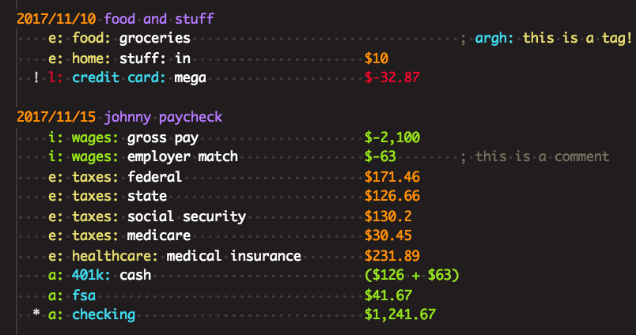
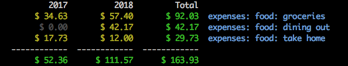
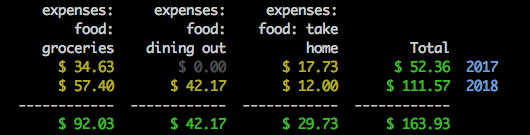
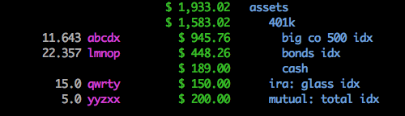

ledgerbil
=========

A small rodent-like program for working with ledger-cli journals.

Some of ledgerbil's features:

  * Automate the entry of recurring transactions via a [scheduler](#--schedule).
  * Interactively [reconcile](#--reconcile-acct) accounts.
  * [Sort](#--sort) a file by transaction date.
  * Display balances or net worth by year or month in a [grid](#grid) format.
  * Display [investments](#investments-or-inv) with dollar and share amounts side by side.

Hi. I'm a personal finance enthusiast. Keeping my records organized and
analyzable is a soothing and reassuring activity for me. I used
Microsoft Money from 1995 to 2007, KMyMoney from 2008 to 2012, and
Ledger from 2013 to this very moment. Ledger is nifty:

http://www.ledger-cli.org/

It's strictly a reporting tool. From the web site: "Ledger never creates
or modifies your data. Your entries are kept in a text file that you
maintain, and you can rest assured, no automated tool will ever change
that data."

That is, no automated tool within the ledger program itself. But you can
create or find tools to help with various data entry and reconciliation
chores, or to report on your data in ways not supported by ledger.

There's a whole galaxy of tools for working with ledger or ledger-like
programs and their data, which you can learn about at:

https://plaintextaccounting.org/

At a minimum, all you really need is a text editor for data entry. I'm
using VSCode for my journal, and with the [syntax highlighting files 
included in this repo](/syntax), I find it pleasant to work with and 
look upon:



Why yet another tool? Why ledgerbil? I had my own ideas for features,
and it's fun to have a project to work on. Let's look at a few examples 
of reporting options before moving on to a rambling preamble and then
a deeper dive...

A grid report:



```
          2017          2018         Total
       $ 34.63       $ 57.40       $ 92.03  expenses: food: groceries
        $ 0.00       $ 42.17       $ 42.17  expenses: food: dining out
       $ 17.73       $ 12.00       $ 29.73  expenses: food: take home
  ------------  ------------  ------------
       $ 52.36      $ 111.57      $ 163.93
```

A grid report with rows and columns transposed:



```
     expenses:     expenses:     expenses:
         food:         food:    food: take
     groceries    dining out          home         Total
       $ 34.63        $ 0.00       $ 17.73       $ 52.36  2017
       $ 57.40       $ 42.17       $ 12.00      $ 111.57  2018
  ------------  ------------  ------------  ------------
       $ 92.03       $ 42.17       $ 29.73      $ 163.93
```

An investment report:



```
                         $ 1,933.02   assets
                         $ 1,583.02      401k
      11.643 abcdx         $ 945.76        big co 500 idx
      22.357 lmnop         $ 448.26        bonds idx
                           $ 189.00        cash
        15.0 qwrty         $ 150.00      ira: glass idx
         5.0 yyzxx         $ 200.00      mutual: total idx
```

I don't use many of ledger's features and options, so your mileage may
vary for your own data. Please back up before trying, or make sure your
changes are committed to the source control system you certainly should
be using.

One of my goals with ledgerbil is that it shouldn't modify or reformat
your journal entries except in limited and expected ways which are
called out below.

Ledgerbil will assume a properly formatted ledger file, although it
won't necessarily enforce rules or report problems with an input file.
It will be best to feed it files that run cleanly through ledger-cli.

Preamble: A Note to Prospective Users and Contributors
------------------------------------------------------

In many ways, ledgerbil is tuned to my own usage of ledger. It will be
fine with me if I'm the only one that ever uses it.

*However,* I heart emoji free software and am happy to share my work and
would be thrilled if others find ledgerbil useful. I don't necessarily
want to make this thing rigidly conform to my own use cases, but the
likelihood of that happening grows greater by the day.

Please let me know if you try it and run into problems. Many of those
problems I'll either be unable or unwilling to address, because I'm
terrible, but there are many others for which the opposite will be true.
Ledger has so many features and I use a fairly small subset. I'd like to
make ledgerbil as flexible as possible for reading files that use a
larger subset, even if it doesn't know what to do about that subset.

I'm also open to other contributors! But you'll have to suffer my
mediocre coding skills and practices. If you submit a PR for something
really good, I might not understand it enough to feel comfortable
maintaining it. Or I might be overly picky about how I think ledgerbil
should work. Please let me know if there's something you'd like to do so
I can help you decide if it's worth your time. (Obviously you're free to
do whatever you want with your own copy.)

One thing that bothers me is the horrendous state of naming things and
that dollars are assumed. My earlier life and financial software
experience had me thinking in terms of dollars and investment shares and
that has carried over here. I'd be interested in someday more accurately
describing things more generically in terms of commodities and amounts,
but, *phew,* that will be a lot of work.

The state of documentation for ledgerbil reflects my doubts on whether
it will in fact be useful and used by others. I'd like to have great,
thorough documentation, but if it's just me, is it worth my time? I
think you'll find that several things are well-documented and others not
at all, and I'm sorry about that if you are searching and finding the
docs lacking.

Post Preamble
-------------

***And now!*** Here is the current state of --help, which reflects the
current state of exciting features:

```
$ ./main.py --help

usage: ledgerbil/main.py [-h] [-f FILE] [-S] [-r ACCT] [-R] [-s FILE]
                         [-n]

{helpful text omitted}

optional arguments:
  -h, --help                 show this help message and exit
  -f FILE, --file FILE       ledger file(s) to be processed
  -S, --sort                 sort the file(s) by transaction date
  -r ACCT, --reconcile ACCT  interactively reconcile ledger file(s)
                             with this account regex; scheduler/sort
                             have no effect if also specified
  -R, --reconciled-status    show accounts where reconciler previous
                             balance differs from cleared balance in
                             ledger
  -s FILE, --schedule FILE   scheduled transactions file, with new
                             entries to be added to -f ledger file; if
                             given multiple ledger files, will use the
                             first; if --sort also specified, sorts the
                             ledger file after entries have been added
  -n, --next-scheduled-date  show the date of the next scheduled
                             transaction

other commands (run with -h to see command help):
    ledgerbil/main.py
        grid                    ledger reports in year/month tables
        investments (or inv)    nicer view of shares and dollars
        pass                    passthrough to ledger
        portfolio (or port)     standalone investment tracker
```

## --sort

Sort files by transaction date. Ledgerbil understands a transaction as
something that starts with a date in the first position, like so:

```
2013/05/11 abc store
    expenses: leisure: games
    liabilities: credit card                $-12.34
```

If there are comment lines or things it doesn't currently understand
(e.g. lines starting with `payee` or `account`), it will glom these
together with the nearest transaction that comes before, so that the
ordering of things will be maintained accordingly. If these items occur
before any dated transactions, they will be given a date in 1899 to
(most likely) keep them before your other transactions. (With that date
being used only for sorting purposes and not written to file.)

Sorting should only change the order of items and not otherwise modify
transactions, but note that it will "normalize" spacing so that there is
only one space between entries.

Sorting is useful with the scheduler, which will simply add entries to
the end of the specified journal file. (The schedule file itself is
always sorted after each run so that things will mostly be in order.)

## --schedule

The schedule file handles recurring transactions and has two levels of
configuration.

At the top of the file, for example:

    ;; scheduler ; enter 40 days

This determines how many days ahead transactions should be entered into
the specified ledger file. Perhaps you'll run:

    python main.py --file journal.ledger --schedule schedule.ldg

This will read the ``schedule.ldg`` file and create new entries in
``journal.ledger`` up to 40 days into THE FUTURE. ``schedule.ldg`` will
also be updated to reflect next dates.

Individual entries use this format on the line below the top line:

    ;; schedule ; interval uom ; days ; interval ; notes

For example, the monthly `interval uom` (unit of measure):

```
2018/01/22 lightning electricity         ; todo
    ;; schedule ; monthly
    e: bills: electricity
    a: checking                             $75
```

Will cause entries to be created on the 22nd of every month, starting in
January 2018. The `;; schedule` line will be removed for the journal
entry. For recurring items with varying amounts, I usually include a `;
todo` comment on the top line as a reminder to go back and set the
actual amount later, but that's just a convention. You can include
whatever you want on the non-schedule lines. The only thing modified is 
the date.

Supported units are `monthly`, `weekly`, and `daily`. Weekly
transactions will recur on the same day of the week as the date in the
entry.

Other supported UOMs: `bimonthly` (every 2 months), `quarterly`,
`biannual`, `yearly`

The `days` spot can be used to specify more than one day in a month, e.g.:

```
2018/01/12 johnny paycheck
    ;; schedule ; monthly ; 15, 30
    i: wages: gross pay                   $500
    [...]
```

Will cause entries to be created on the 15th and 30th of every month. If
you start with an entry as above with 2018/01/12, it will first create
an entry on that date, and then rotate between the other two. The
schedule file entry will always show the date of the next entry to be
added.

What will this scheduled transaction do for the 30th, when confronted
with February? It will use the 28th or the 29th. You can also specify
`eom` (end of month) which will use the last day of the month, or
`eom30` which will use the 30th for every month except February, in
which it will again fall back to the 28th or the 29th.

The `days` list can also be space delimited, e.g.

    ;; schedule ; monthly ; 15 30

Finally, the `days` list is only used for `monthly` schedules. Perhaps
in the future we'll support multiple days of the week for `weekly`
schedules.

The `interval` spot can be used to specify some other interval, e.g.:

```
2018/02/17 chop chop hair
    ;; schedule ; weekly ;; every 6 weeks
    e: misc: haircuts
    l: credit card: mega                    $-18
```

You can also simply use `6` there. Ledgerbil will pick out the first
number it finds.

Daily `interval uom` will simply recur every `interval` number of days,
e.g.:

```
2018/06/15 iron bank
    ;; schedule ; daily ;; every 30 days
    e: bank: loan interest
    a: checking                             $-25
```

Would result in entries:

```
    2018-06-15 iron bank
    2018-07-15 iron bank
    2018-08-14 iron bank
    2018-09-13 iron bank
```

The last spot for `notes` isn't parsed by ledgerbil. I sometimes use it
to note when a scheduled item isn't an automated payment.

```
2018/02/17 chop chop hair
    ;; schedule ; weekly ;; every 6 weeks ; or whenevs
```

## --reconcile ACCT

Interactively reconcile the account matching `ACCT` regex.

Example usage:

    python main.py --file journal.ledger --reconcile 'bank: xyz'

You can specify a regex for `--reconcile`, e.g. `bank..xyz$` would also
work and prevent a match on your other account `bank: xyzzyx`.

Help is available at the interactive prompt:

```
> help

Documented commands (type help <topic>):
========================================
account  finish  list  quit    show       unmark
aliases  help    mark  reload  statement
```

As mentioned above, this is targeted for my own use, although it may be
suitable for those with similar needs. (I didn't spend time on some
scenarios that I would address if, miraculously, someone else cared
about them. And there are other scenarios I won't address in any
circumstance, given my aims here.)

The reconciler will error if more than one matching account is found.
Aliases aren't resolved so the same account will be seen as different if
it occurs in aliased and non-aliased form. (I keep my alias definitions
in a separate account file.) Related to this, the reconciler does *not*
handle the shortcut of marking entire transactions pending or cleared on
the top line, since we only want to work with one account at a time.

If multiple entries for the account occur in one transaction, they'll be
treated as one amount and line item while reconciling. If they have
different statuses initially, there'll be an error. (When in sync,
they'll be updated to pending/cleared status together.)

The reconciler will total up all cleared (`*`) transactions to get what
should be the "last statement balance," but only shows pending and
uncleared transactions.

The only changes the reconciler should make to your data is adding or
subtracting the pending `!` and cleared `*` symbols to the white space
in front of posting lines within a transaction, but see the note below
about *how* it does this.

Reconciliation also works for commodities like `abcdx` and `lmnop` here:

```
2017/11/15 zombie investments
  * a: 401k: big co 500 idx            1.745 abcdx @   $81.23
    a: 401k: bonds idx                 2.357 lmnop @   $20.05
    a: 401k: cash             $-189
```

The quantity will be used rather than a dollar amount in this case.

Let's see the reconciler in action. For an example file:

```
2016/10/21 dolor
    i: sit amet
  * a: cash         $100

2016/10/26 lorem
    e: consectetur adipiscing elit
    a: cash         $-10

2016/10/29 ipsum
    e: sed do eiusmod
    a: cash         $-20
```

### list

(Note that there is pretty coloring in real life.)

```
$ ./main.py -f xyz.ldg -r cash

   1. 2016/10/26    $-10.00   lorem
   2. 2016/10/29    $-20.00   ipsum

ending date: 2016/10/29 ending balance: (not set) cleared: $100.00

>
```

The 10/21 cash entry is counted for the cleared amount, but not shown.

Regular expressions are allowed for the `-r/--reconcile` argument. Let's
say you have another account, `a: cash jar`. You can specify `-r cash$`
to limit the match. 

### statement

Will prompt you for the statement ending date and ending balance.

```
> statement
Ending Date (YYYY/MM/DD) [2016/10/29]:
Ending Balance []: 70

   1. 2016/10/26    $-10.00   lorem
   2. 2016/10/29    $-20.00   ipsum

ending date: 2016/10/29 ending balance: $70.00 cleared: $100.00
to zero: $-30.00
```

Only transactions on or before that date will be shown, with the
exception of pending transactions. All pending transactions are included
regardless of date because they're needed to make the math work.

You can mark and unmark transactions without the ending balance but you
can't finish balancing and convert pending transactions to cleared until
it's set.

Reconciler doesn't understand asset versus liability accounts so you'll
want to give a positive amount for assets and negative for liability,
assuming the normal state of these kinds of accounts.

Statement ending info is saved to `RECONCILER_CACHE_FILE` (from
`settings.py`, or using the default `~/.ledgerbil_reconciler_cache`) and
restored when the reconciler is restarted.

### mark / unmark

Set transactions as pending (`!`) or remove the pending mark. You can
enter one or more line numbers, transaction amounts, or "all" for all
lines.

To specify an amount, include a decimal point, for example: `12.`
or `6.37`

If multiple transactions have the same amount, the first "available"
transaction will be used. That is, if you are marking a transaction as
pending, the reconciler will look for a match that is not already marked
pending. If all matches are already pending, it will use the first
match, which will result in a message that it has already been marked
pending.

Giving a single line number or amount by itself with no command will be
interpreted as a mark command.

```
> mark 1 2

(or)

> mark all

1. 2016/10/26    $-10.00 ! lorem
2. 2016/10/29    $-20.00 ! ipsum

ending date: 2016/10/29 ending balance: $70.00 cleared: $100.00
to zero: $0.00

> unmark 2

1. 2016/10/26    $-10.00 ! lorem
2. 2016/10/29    $-20.00   ipsum

ending date: 2016/10/29 ending balance: $70.00 cleared: $100.00
to zero: $ -20.00

> mark -20.

1. 2016/10/26    $-10.00 ! lorem
2. 2016/10/29    $-20.00 ! ipsum

ending date: 2016/10/29 ending balance: $70.00 cleared: $100.00
to zero: $ 0.00
```

The ledger file is saved after every mark/unmark command.

Ledger allows a lot of flexibility in file formatting, and in general,
ledgerbil attempts to preserve all formatting, but in this case, for
simplicity's sake, ledgerbil uses a four space indent for transaction
entries, with the `!` or `*` going in the third "space" when present.

It wouldn't be *that* hard to make it smarter about this, but I didn't
want to deal with some edge cases in the initial implementation. (And
note, again, that the reconciler only works with individual account
entries; never the whole transaction on the top line.)

### show

Show transaction details

```
> show 2

2016/10/26 lorem
    e: consectetur adipiscing elit
    a: cash         $-10
```

### reload

Reload the ledger file from storage.

Ledgerbil loads the entire file into memory when it starts, and writes
after mark/unmark operations. This command lets you make an update
outside of the reconciler (e.g. in an editor) and refresh without having
to restart the program.

### finish

If "to zero" is 0, this command will update all pending (`!`) entries for
the account to cleared (`*`) and save the file.

```
> finish

last reconciled: 2016/10/29 previous balance: $ 70.00
ending date: 2016/10/29 ending balance: (not set) cleared: $70.00
```

After `finish`, the previous balance is saved in the cache (mentioned
above and more below!) and shown when you next reconcile this account,
which may be helpful for catching mistakes you make between visits to
the reconciler.

### aliases

Shows available shortcuts, for example, `m` for `mark`.

### --reconciled-status, -R

There is also the `--reconciled-status` option for ledgerbil which will
go through all your cached entries and compare to ledger's `--cleared`
totals to see if things have gotten out of sync somehow.

Note that where the interactive reconciler only uses
`RECONCILER_CACHE_FILE`, `--reconciled-status` needs more stuff
configured in `settings.py` so that ledgerbil can run ledger as an
external program.

## "ledgershell" (other commands)

The ledgershell programs use ledger to read and report on your data in
different ways. None of them modify your data.

(`portfolio` is listed with "other commands", but isn't a ledgershell
program, and currently has nothing to do with ledger or ledger data.)

There is little documentation other than the code and `--help`, which is
included below but often changing, so please don't count on this readme 
for the latest.

### settings.py

Intended as a convenience, the `settings.py` file is meant to have all
the information needed to run ledger so you don't have to pass in
everything every time. And, related to the ambivalence about
documentation mentioned above, there isn't any documentation for this
file yet. Just [`settings.py.example`][settings] which you should copy
to `settings.py` in the same directory and then modify for your own
needs.

[settings]: /ledgerbil/settings.py.example

### grid

```
usage: ledgerbil/main.py grid [-h] [-y | -m] [-b DATE] [-e DATE]
                              [-p PERIOD] [--current] [--depth N]
                              [--payees] [--net-worth] [--limit-rows N]
                              [-T] [-s SORT] [-t] [--csv] [--tab]
                              [--no-color]

Show ledger balance report in tabular form with years or months as the
columns. Begin, end, and period params are handled as ledger interprets
them, and all arguments not defined here are passed through to ledger.

Don't specify bal, balance, reg, or register!

e.g. ./main.py grid expenses -p 'last 2 years' will show expenses for
last two years with separate columns for the years.

Begin and end dates only determine the range for which periods will be
reported. They do not limit included entries within a period. For
example, with --year periods, specifying --end 2018/07/01 will cause
all of 2018 to be included.

Currently supports ledger --flat reports. (Although you don't specify
--flat.)

Payee reports will also pass through ledger arguments. It is best to
specify an account to constrain the query, e.g. expenses. If not given
any accounts, ledger gives odd results for the query used by ledgerbil:

register --group-by '(payee)' --collapse --subtotal --depth 1

optional arguments:
  -h, --help                  show this help message and exit
  -y, --year                  year grid (default)
  -m, --month                 month grid
  -b DATE, --begin DATE       begin date
  -e DATE, --end DATE         end date
  -p PERIOD, --period PERIOD  period expression
  --current                   exclude future transactions
  --depth N                   limit the depth of account tree for
                              account reports
  --payees                    show results by payee (results may be
                              nonsensical if you do not specify
                              accounts, e.g. expenses)
  --net-worth                 show net worth at end of periods
  --limit-rows N              limit the number of rows shown to top N
  -T, --total-only            show only the total column
  -s SORT, --sort SORT        sort by specified column header, or "row"
                              to sort by account or payee (default: by
                              total)
  -t, --transpose             transpose columns and rows (row sorting
                              will then apply to columns)
  --csv                       output as csv
  --tab                       output as tsv (tab-delimited)
  --no-color                  output without color
```

### investments (or inv)

```
usage: ledgerbil/main.py inv [-h] [-a ACCOUNTS] [-e DATE] [-c]

Viewing shares with --exchange is kind of weird in ledger. This creates
a report that shows share totals and dollar amounts in a nicer way.

optional arguments:
  -h, --help                        show this help message and exit
  -a ACCOUNTS, --accounts ACCOUNTS  balances for specified accounts
                                    (default: 401k or ira or mutual)
  -e DATE, --end DATE               end date (default: tomorrow)
  -c, --command                     print ledger commands used
```

### pass (passthrough to ledger)

I have a different `settings.py` file that I use for development, and 
find this useful for running ledger against the sample files included
in this repo.

```
usage: ledgerbil/main.py pass [-h] [--command]

Pass through args to ledger, running ledger with config from
settings.py

optional arguments:
  -h, --help  show this help message and exit
  --command   print ledger command used
```

### portfolio (or port)

If anything needs documentation, it's this oddball program. But then
again, this is a particularly apt example of something tailored to my
own interests.

I once read some advice for simple investment tracking which I
translated into an Excel spreadsheet, and then wrote a crazy mess of VBA
code to work with it, and then tamed that code slightly when translating
into an OpenOffice.org spreadsheet with its VBA-like macro language,
and now have finally brought into ledgerbil with this thing. (You can
decide for yourself how crazy is the current mess of code.)

You can run it with the included [sample data](/sample), and one of the
things it will produce is a report like this:


```
6 years, 4 accounts: 401k: big co 500 idx, 401k: bonds idx, ...

year    contrib   transfers        value   gain %     gain val    all %    3yr %    5yr %
2015    $ 1,000    $ 29,000     $ 33,093    20.62      $ 3,093    20.62
2016    $ 8,235    $ 10,000     $ 59,407    19.14      $ 8,079    19.88
2017      $ 750                 $ 81,322    35.40     $ 21,165    24.84    24.84
2018                            $ 81,322     0.00          $ 0    18.11    17.28
2019      $ 600    $ -5,000     $ 84,061     9.02      $ 7,139    16.23    13.86    16.23
2020      $ 450                 $ 80,493    -4.77     $ -4,018    12.44     1.26    10.87
       $ 11,035    $ 34,000                           $ 35,458
```

It is currently a breathtakingly manual process to add data to the
`portfolio.json` file and I imagine few people will want to bother with
it, even if it made any sense.

```
usage: ledgerbil/main.py port [-h] [-a REGEX] [-L LABELS] [-c] [-C]
                              [-s SORT] [-H] [-l]

Portfolio! This is currently independent of ledger data although
eventually some integration would be swell. Uses a json data file
to give you a simple yearly view of your investing portfolio.

optional arguments:
  -h, --help                  show this help message and exit
  -a REGEX, --accounts REGEX  include accounts that match this regex,
                              default = .* (all)
  -L LABELS, --labels LABELS  include accounts that match these labels
  -c, --compare               compare accounts or labels
                              (if --labels, will group by labels)
  -C, --compare-accounts      compare accounts only
                              (labels still modifies included accounts)
  -s SORT, --sort SORT        sort comparison report by:
                                v (alue)
                                g (ain value)
                                y (ears)
                                a (ll years gain) default
                                1 (year gain)
                                3 (year gain)
                                5 (year gain)
                                10 (year gain)
  -H, --history               show account history
  -l, --list                  list account names and labels
```

### license

GPL v3 or greater
