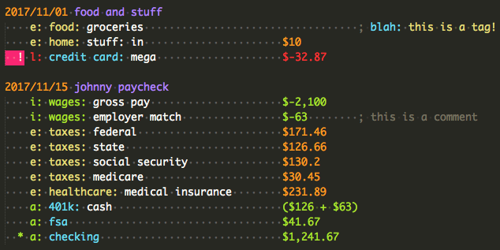
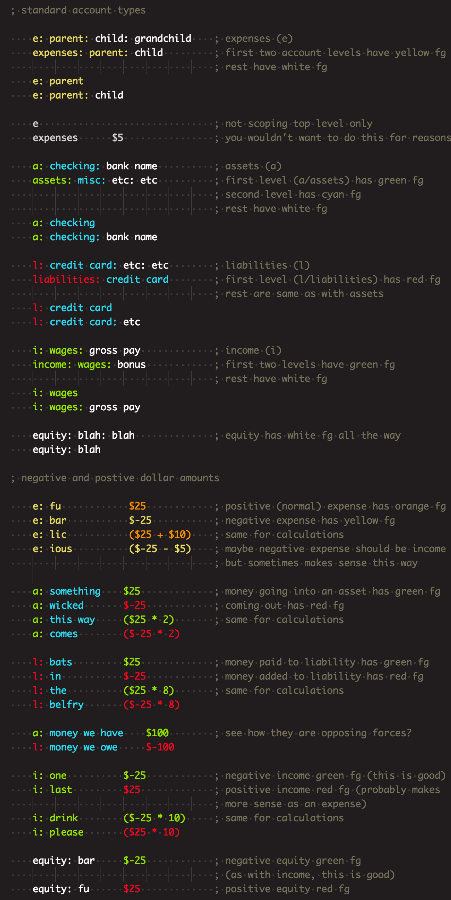
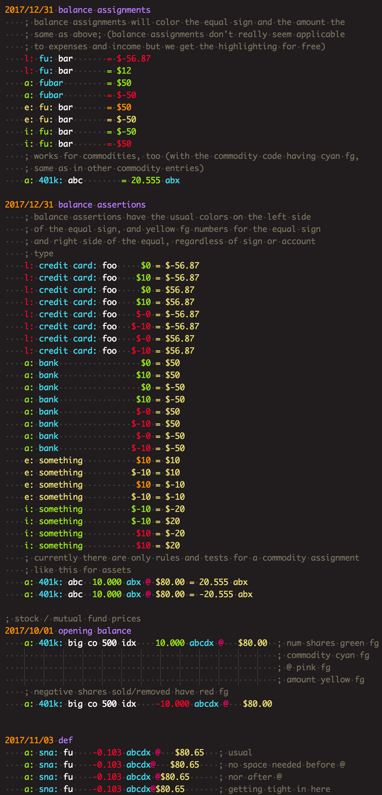
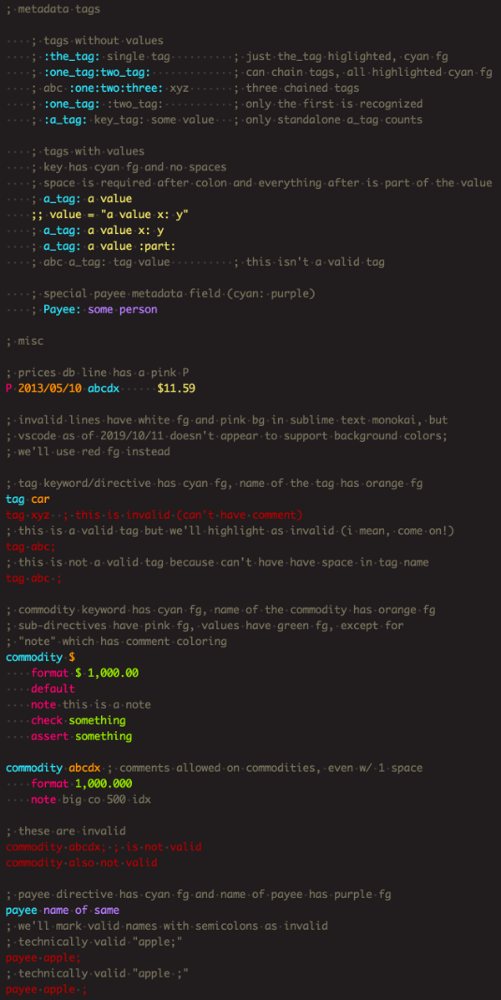

# Syntax Highlighting

VSCode and Sublime Text support [TextMate language grammars][1] for syntax highlighting. Sublime Text 3 also has a [newer (better) syntax definition format][2], and a means of [testing][3] both `.tmLanguage` and `.sublime-syntax` files.

I've switched to using vscode as my main editor but still maintaining the newer sublime syntax files, at least for now. (And still using Sublime Text for building/testing.)

The syntax definition files create scopes, and then it is up to your editor's theme to apply colors to those scopes. I use Monokai dark variants and chose scopes that looked good to me (initially in Sublime Text SoDaReloaded theme). Included here are settings for both editors that match any screenshots you see in this repo, like this one:

Below are instructions on using the ledger definitions in either editor, along with theme coloring, and then more on testing, building, and sundry.

## VSCode

`syntax/vscode/sc-ledger` is a vscode plugin that you can place in your `~/.vscode/extensions` dir. (You'll then have `~/.vscode/extensions/sc-ledger`.)

It may then take a reload to see `.ldg` and `.ledger` files highlighted according to your current theme.

If you want to use "my" colors, copy entries from `syntax/vscode/vscode-settings.json` into your own `settings.json`. Since you probably already have your own settings, just copy entries as needed into the `editor.tokenColorCustomizations / textMateRules` section. These are targeted specifically to ledger scopes and won't override other languages.

## Sublime Text

Put `syntax/sublime/ledger.sublime-syntax` in your Sublime Text `User` dir, e.g.

    ~/Library/Application Support/Sublime Text 3/Packages/User

This will apply syntax highlighting to files with extensions `ldg` and
`ledger`.

I use `"theme": "SoDaReloaded Dark.sublime-theme",` in ST3, and in
my `Preferences.sublime-settings -- Default` settings there is: `"color_scheme": "Monokai.sublime-color-scheme",`. This scheme is overridden by a file in `User` dir named the same, and included here: `syntax/sublime/Monokai.sublime-color-scheme`. You can copy settings as needed into your own override file if you already have one. (You may have a different `color_scheme`?)

## Testing

As far as I know, [testing][3] is a Sublime Text only thing, but you can test the `tmLanguage` file that VSCode uses.

`syntax_test_ledger.ldg` can be placed in the `User` dir alongside `.sublime-syntax` and `.tmLanguage` files, and running `build` on it will run tests against the targeted file, which is specified by the first line in the test file:

    # SYNTAX TEST "Packages/User/ledger.tmLanguage"

HOWEVER. I find that if I also have `ledger.sublime-syntax` present, the tests will run against that instead, so I usually gzip the sublime syntax file when I want to test tmLanguage.

Another thing to be aware of is that the test file doesn't want to work when it's in a symlinked directory. My `User` dir is symlinked so I put `syntax_test_ledger.ldg` up one level in `Packages`.

## Building

Sublime Text has [PackageDev][4] for working with syntax definition files and tests. It can convert YAML/JSON tmLanguage files into the plist (XML) format.

`ledger.YAML-tmLanguage` is included here in the vscode subdir, and is in the extension as `ledger.tmLanguage` plist format. (As mentioned, it would work for Sublime Text, too, but there we're using `ledger.sublime-syntax` so it made sense to me to separate things this way. I found [ST3 docs][4] helpful for understanding the older YAML format.)

There's no build needed for the `.sublime-syntax` files.

VSCode has [TextMate Languages][6] for highlighting YAML/JSON tmLanugage files, and is also able to convert between YAML/JSON/XML formats.

I really liked working with Sublime's [newer syntax definition][2]. With contexts and pushing and popping, you have a lot more control. And being able to define variables was a relief for avoiding regex duplication.

When I had to go back to tmLanguage for VSCode, I created a crude system for handling "variables." They are defined in comments in `ledger-vars.YAML-tmLanguage`, e.g.:

    # amount_start                      \\s*=?\\s*[(]?\\s*[$£€¥₹]?\\s*
    # amount_end                        [ \\d\\.,()+*/$-]+

And turn something like this:

    - match: "{{expenses}}{{account_parent}}{{account_children}}(?:{{more_than_zero_amount}}|{{less_than_zero_amount}})?(?:{{commodity_stuff}})?(?:{{balance_a}})?"

Into this:

    - match: "^[!*\\s]+(e(?:xpenses)?: ?)([^:;]+?(?::|(?=  |\\t|$)))([^;]*?(?=  |\\t|$))(?:(\\s*=?\\s*[(]?\\s*[$£€¥₹]?\\s*\\d(?:[ \\d\\.,()+*/$-]+)?)|(\\s*=?\\s*[(]?\\s*[$£€¥₹]?\\s*-[ \\d\\.,()+*/$-]+))?(?:([a-zA-Z_]+\\s*)(@\\s*)?(\\s*=?\\s*[(]?\\s*[$£€¥₹]?\\s*[ \\d\\.,()+*/$-]+)?)?(?:(=[^;]+)?)?"

I'd find the second version much harder to maintain, so to me it's worth introducing yet another moving part into this process: the `yaml_tmlanguage_helper.py` script. It does all the variable replacements and turns `ledger-vars.YAML-tmLanguage` into `ledger.YAML-tmLanguage`, which can then be converted into `ledger.tmLanguage`.

## More Colors

I use `syntax/syntax_example.ledger` when working with this stuff for an at-a-glance view of all the things. The screenshots below should give you a good picture of what is currently handled.

You can see we're expecting standard top-level account names: expenses, assets, liabilities, income, and equity, with one-letter aliases for all but equity.

[1]: https://macromates.com/manual/en/language_grammars
[2]: https://www.sublimetext.com/docs/3/syntax.html
[3]: https://www.sublimetext.com/docs/3/syntax.html#testing
[4]: http://docs.sublimetext.info/en/latest/extensibility/syntaxdefs.html
[5]: https://github.com/SublimeText/PackageDev
[6]: https://github.com/Togusa09/vscode-tmlanguage
