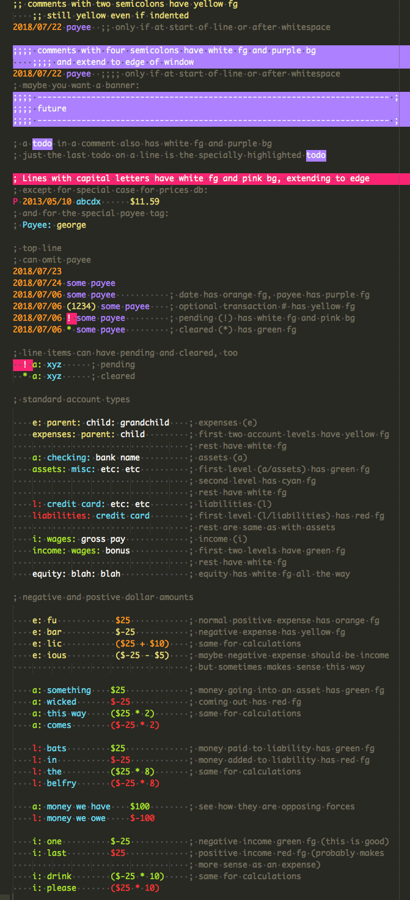

# Syntax Highlighting

`ledger.sublime-syntax` can be placed in Sublime Text's `User` dir, e.g.

    ~/Library/Application Support/Sublime Text 3/Packages/User

This will apply syntax highlighting to files with extensions `ldg` and
`ledger`. From the included sample file for the Monokai color scheme:

`syntax_test_ledger.ldg` can be placed in the `User` dir as well and the
`build` command will run the included tests. (My User dir is symlinked
to Drobox and I got errors running the tests, so I moved it up a level
to Packages.)

More about Sublime Text syntax definitions:

* http://docs.sublimetext.info/en/latest/extensibility/syntaxdefs.html
* http://www.sublimetext.com/docs/3/syntax.html

`.sublime-syntax` is a newer syntax definition format. Still included
here are the older tmLanguage files. The `ledger.JSON-tmLanguage` file
is used to generate the XML `.tmLanguage` file, which likewise would be
placed in the User dir.
